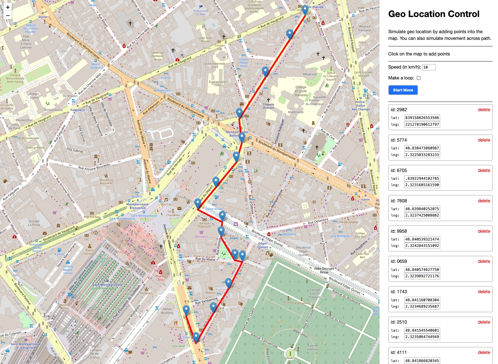

# Geo Location Control Web Extension

Simulate geolocation by adding points into a map.

You can also simulate movement across path.

## Who is it for?

This extension is mostly for developers.

This is an extension to help you develop location based web applications.

It will override the location APIs to return fake positions, including 'in movement' positions.

You can either add one point, and the API will get its coordinate,
or multiple points and use the "Start Move" button, then the API will return the current position of the agent based on time and speed.

Note: for this part to work, you must keep the extension page open.

<!--  -->

## Technical aspects

Behind the scene, this will override:
 - `navigator.geolocation.getCurrentPosition`
 - `navigator.geolocation.watchPosition`

# Contribute

This is a preview version, it does the job for now.

Still, contributions are welcome.
